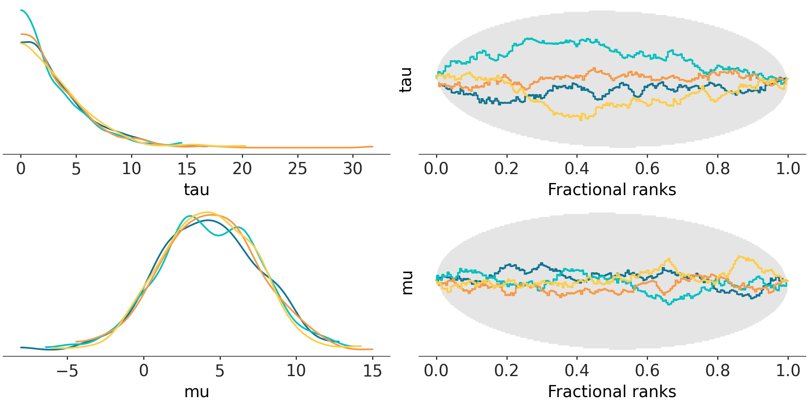
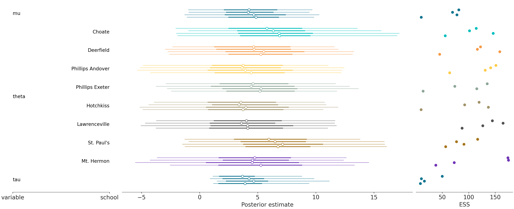

</img>
</img>

[](https://badge.fury.io/py/arviz)
[](https://doi.org/10.21105/joss.01143) [](https://doi.org/10.5281/zenodo.2540945)
[](https://numfocus.org)

ArviZ (pronounced "AR-_vees_") is a Python package for exploratory analysis of Bayesian models. It includes functions for posterior analysis, data storage, model checking, comparison and diagnostics.

### ArviZ in other languages
ArviZ also has a Julia wrapper available [ArviZ.jl](https://julia.arviz.org/).

## Documentation

The ArviZ documentation can be found in the [official docs](https://python.arviz.org).
Here are some quick links for common scenarios:

* First time Bayesian modelers and ArviZ users: [EABM book](https://arviz-devs.github.io/EABM/)
* First time ArviZ users, already familiar with Bayesian modeling: [overview notebook](https://python.arviz.org/projects/plots/en/latest/tutorials/overview.html) or [example gallery](https://python.arviz.org/projects/plots/en/latest/gallery/index.html)
* ArviZ 0.x user: [migration guide](https://python.arviz.org/en/latest/user_guide/migration_guide.html)
* ArviZ-verse documentation:
  - [arviz-base](https://python.arviz.org/projects/base/en/latest/)
  - [arviz-stats](https://python.arviz.org/projects/stats/en/latest/)
  - [arviz-plots](https://python.arviz.org/projects/plots/en/latest/)


## Installation

### Stable
ArviZ is available for installation from [PyPI](https://pypi.org/project/arviz/).
The latest stable version can be installed using pip:

```
pip install "arviz[preview]"
```

ArviZ is also available through [conda-forge](https://anaconda.org/conda-forge/arviz).

```
conda install -c conda-forge arviz arviz-plots
```

### Development
The latest development version can be installed from the main branch using pip:

```
pip install git+git://github.com/arviz-devs/arviz.git
```

Another option is to clone the repository and install using git and setuptools:

```
git clone https://github.com/arviz-devs/arviz.git
cd arviz
python setup.py install
```

-------------------------------------------------------------------------------
## [Gallery](https://python.arviz.org/en/latest/examples/index.html)

<p>
<table>
<tr>

  <td>

  [](https://arviz-plots.readthedocs.io/en/stable/api/generated/arviz_plots.plot_rank_dist.html)

  </td>

  <td>

  [](https://arviz-plots.readthedocs.io/en/stable/api/generated/arviz_plots.plot_forest.html)

  </td>

</tr>
</table>
<div>

  <a href="https://python.arviz.org/projects/plots/en/latest/gallery/index.html">And more...</a>
</div>


## Citation


If you use ArviZ and want to cite it please use [](https://doi.org/10.21105/joss.01143)

Here is the citation in BibTeX format

```
@article{arviz_2019,
  doi = {10.21105/joss.01143},
  url = {https://doi.org/10.21105/joss.01143},
  year = {2019},
  publisher = {The Open Journal},
  volume = {4},
  number = {33},
  pages = {1143},
  author = {Ravin Kumar and Colin Carroll and Ari Hartikainen and Osvaldo Martin},
  title = {ArviZ a unified library for exploratory analysis of Bayesian models in Python},
  journal = {Journal of Open Source Software}
}
```


## Contributions
ArviZ is a community project and welcomes contributions.
Additional information can be found in the [contributing guide](https://python.arviz.org/en/latest/contributing/index.html)


## Code of Conduct
ArviZ wishes to maintain a positive community. Additional details
can be found in the [Code of Conduct](https://www.arviz.org/en/latest/CODE_OF_CONDUCT.html)

## Donations
ArviZ is a non-profit project under NumFOCUS umbrella. If you want to support ArviZ financially, you can donate [here](https://numfocus.org/donate-to-arviz).

## Sponsors and Institutional Partners
[](https://www.aalto.fi/en)
[](https://fcai.fi/)
[](https://numfocus.org)

[The ArviZ project website](https://www.arviz.org/en/latest/sponsors_partners.html) has more information about each sponsor and the support they provide.
