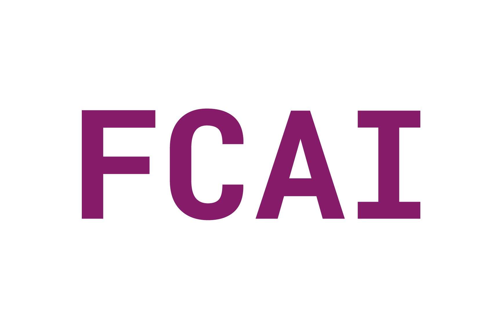
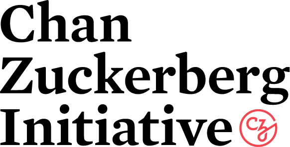

---
html_theme.sidebar_secondary.remove:
sd_hide_title: true
---

<!-- CSS overrides on the homepage only -->

(homepage)=
# ArviZ: Exploratory analysis of Bayesian models

  <!-- Start Hero Left -->
  <h2 style="font-size: 60px; font-weight: bold; margin: 2rem auto 0;">ArviZ</h2>
  <h3 style="font-weight: bold; margin-top: 0;">Exploratory analysis of Bayesian models</h3>
  
ArviZ is a Python package for exploratory analysis of Bayesian models. It serves as a backend-agnostic tool for diagnosing and visualizing Bayesian inference.

  

      <a href="./getting_started/index.html" class="homepage-button primary-button">Get Started</a>
      <a href="./examples/index.html" class="homepage-button secondary-button">See Gallery</a>
  

  

      <a href="./api/index.html" class="homepage-button-link">See API Reference →</a>
  

  <!-- End Hero Left -->

  <!-- Start Hero Right -->

::::::{grid} 1 2 2 2
:gutter: 3

:::::{grid-item-card}
:link: example_plot_trace_bars
:link-type: ref
:shadow: none
:class-card: example-gallery

:::{div} example-img-plot-overlay
Rank Bars Diagnostic with KDE using `plot_trace`
:::

:::{image} ./_images/mpl_plot_trace_bars.png
:::
:::::

:::::{grid-item-card}
:link: example_plot_forest_mixed
:link-type: ref
:shadow: none
:class-card: example-gallery

:::{div} example-img-plot-overlay
Forest Plot with ESS using `plot_forest`
:::

:::{image} ./_images/mpl_plot_forest_mixed.png
:::
:::::

:::::{grid-item-card}
:link: example_plot_dist
:link-type: ref
:shadow: none
:class-card: example-gallery

:::{div} example-img-plot-overlay
Dist Plot using `plot_dist`
:::

:::{image} ./_images/mpl_plot_dist.png
:::
:::::

:::::{grid-item-card}
:link: example_plot_density
:link-type: ref
:shadow: none
:class-card: example-gallery

:::{div} example-img-plot-overlay
Density Plot (Comparison) using `plot_density`
:::

:::{image} ./_images/mpl_plot_density.png
:::
:::::

:::::{grid-item-card}
:link: example_plot_pair
:link-type: ref
:shadow: none
:class-card: example-gallery

:::{div} example-img-plot-overlay
Pair Plot using `plot_pair`
:::

:::{image} ./_images/mpl_plot_pair.png
:::
:::::

:::::{grid-item-card}
:link: example_plot_ppc
:link-type: ref
:shadow: none
:class-card: example-gallery

:::{div} example-img-plot-overlay
Posterior Predictive Check Plot using `plot_ppc`
:::

:::{image} ./_images/mpl_plot_ppc.png
:::
:::::
::::::

<!-- grid ended above, do not put anything on the right of markdown closings -->

  <!-- End Hero Right -->

  <!-- End Hero -->

<!-- Keep in markdown to generate headerlink -->
# Key Features

:::::{grid} 1 1 2 2
:gutter: 5

::::{grid-item-card}
:shadow: none
:class-card: sd-border-0

:::{image} _static/key_feature_interoperability.svg
:::

:::{div} key-features-text
<strong>Interoperability</strong> 
Integrates with all major probabilistic programming libraries: PyMC, CmdStanPy, PyStan, Pyro, NumPyro, and emcee.
:::
::::

::::{grid-item-card}
:shadow: none
:class-card: sd-border-0

:::{image} _static/key_feature_visualizations.svg
:::

:::{div} key-features-text
<strong>Large Suite of Visualizations</strong> 
Provides over 25 plotting functions for all parts of Bayesian workflow: visualizing distributions, diagnostics, and model checking. See the gallery for examples.
:::
::::

::::{grid-item-card}
:shadow: none
:class-card: sd-border-0

:::{image} _static/key_feature_diagnostics.svg
:::

:::{div} key-features-text
<strong>State of the Art Diagnostics</strong> 
Latest published diagnostics and statistics are implemented, tested and distributed with ArviZ.
:::
::::

::::{grid-item-card}
:shadow: none
:class-card: sd-border-0

:::{image} _static/key_feature_comparison.svg
:::

:::{div} key-features-text
<strong>Flexible Model Comparison</strong> 
Includes functions for comparing models with information criteria, and cross validation (both approximate and brute force).
:::
::::

::::{grid-item-card}
:shadow: none
:class-card: sd-border-0

:::{image} _static/key_feature_collaboration.svg
:::

:::{div} key-features-text
<strong>Built for Collaboration</strong> 
Designed for flexible cross-language serialization using netCDF or Zarr formats. ArviZ also has a [Julia version](https://julia.arviz.org/) that uses the same {ref}`data schema <schema>`.
:::
::::

::::{grid-item-card}
:shadow: none
:class-card: sd-border-0

:::{image} _static/key_feature_labeled_data.svg
:::

:::{div} key-features-text
<strong>Labeled Data</strong> 
Builds on top of xarray to work with labeled dimensions and coordinates.
:::
::::
:::::

<!-- Keep in markdown to generate headerlink -->
# Sponsors and Institutional Partners

We thank these institutions for generously supporting the development and maintenance of ArviZ.

::::{grid} 1 3 3 3
:::{grid-item}

:::
:::{grid-item}

:::
:::{grid-item}

:::
::::

<!-- Keep in markdown to generate headerlink -->
# Support ArviZ

::::{grid} 1 1 2 2

:::{grid-item}

<h3>Contributions</h3>

Contributions and issue reports are very welcome at
[the GitHub repository](https://github.com/arviz-devs/arviz).
We have a {ref}`contributing guide <contributing_guide>` to help you through the process.
If you have any doubts, please do not hesitate to contact us on [gitter](https://gitter.im/arviz-devs/community).
:::
:::{grid-item}

<h3>Citation</h3>

If you use ArviZ, please cite it using .

See our {ref}`support page <arviz_org:cite>` for information on how to cite in BibTeX format.
:::

:::{grid-item}
:child-align: justify

<h3>Become a Sponsor</h3>

If your company or institution uses ArviZ,
we encourage you to make a donation to ArviZ or
to allow employees to dedicate some of their time to ArviZ.

<a href="https://www.arviz.org/en/latest/governance/sponsors_partners.html" class="homepage-button primary-button">See Details</a>
:::

:::{grid-item}
:child-align: justify
:class: support-arviz-img-merch

<h3>Shop ArviZ Merchandise</h3>

<a href="https://numfocus.myspreadshop.com/arviz+logo?idea=629e289fc8ee26344a684241" class="homepage-button primary-button">Shop Logo</a>
<a href="https://numfocus.myspreadshop.com/arviz+favicon+design?idea=62a74f17ebe60a221692c6f2" class="homepage-button primary-button">Shop Favicon</a>

:::

:::{grid-item}
:child-align: justify

<h3>Donate</h3>

ArviZ is a non-profit project under the NumFOCUS umbrella. To support ArviZ financially, consider donating through the NumFOCUS website.

<a href="https://numfocus.org/donate-to-arviz" class="homepage-button primary-button">Donate</a>
:::
:::{grid-item}
:child-align: justify
:class: support-arviz-img-donate

:::
::::

:::{toctree}
:maxdepth: 1
:hidden:

Getting Started<getting_started/index>
Example Gallery<examples/index>
User Guide<user_guide/index>
API <api/index>
Community<community>
Contributing<contributing/index>
:::
