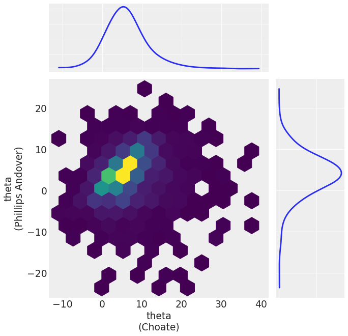
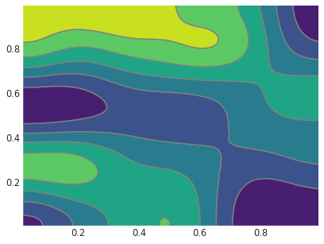
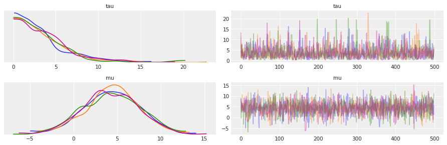
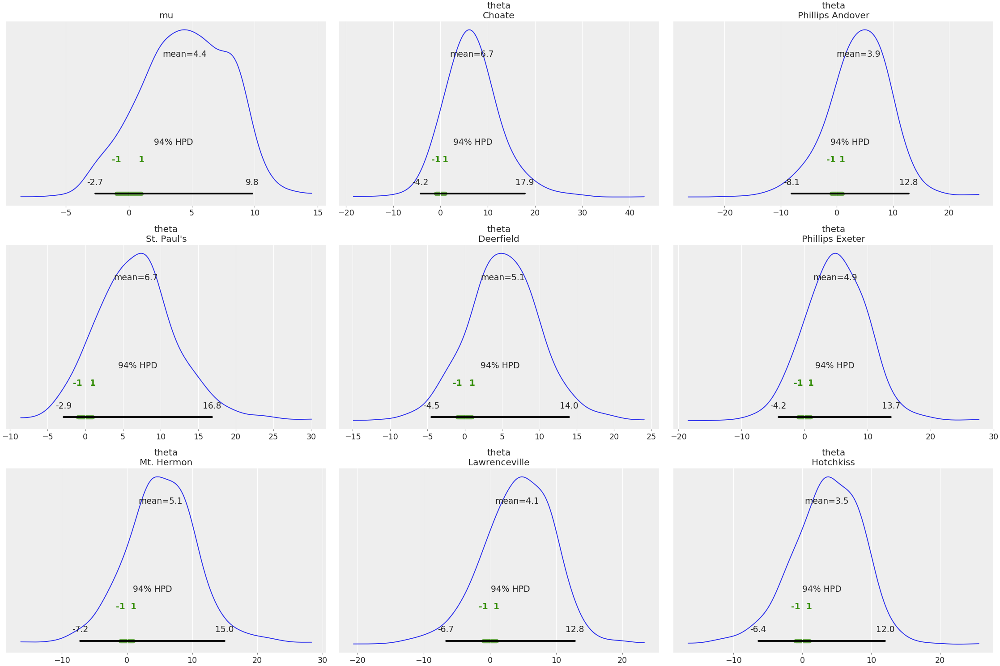

# Summary

While conceptually simple, Bayesian methods can be mathematically and numerically challenging. Probabilistic programming languages (PPLs) implement functions to easily build Bayesian models together with efficient automatic inference methods. This helps separate the model building from the inference, allowing practitioners to focus on their specific problems and leaving PPLs to handle the computational details for them [@zotero-null-295;@bessiere_bayesian_2013;@Ghahramani2015]. The inference process generates a *posterior distribution* — which has a central role in Bayesian statistics — together with other distributions like the *posterior predictive distribution* and the *prior predictive distribution*. The correct visualization, analysis, and interpretation of these distributions is key to properly answer the questions that motivate the inference process.

When working with Bayesian models there are a series of related tasks that need to be addressed besides inference itself:

- Diagnoses of the quality of the inference
- Model criticism, including evaluations of both model assumptions and model predictions
- Comparison of models, including model selection or model averaging
- Preparation of the results for a particular audience

Successfully performing such tasks are central to the iterative and interactive modeling process.
These tasks require both numerical and visual summaries to help statisticians or practitioners
analyze visual summaries. In the words of Persi Diaconis [@DiaconisTheoriesDataAnalysis2011]
"Exploratory data analysis seeks to reveal structure, or simple descriptions in data. We look at
numbers or graphs and try to find patterns. We pursue leads suggested by background information,
imagination, patterns perceived, and experience with other data analyses".

For these reasons we introduce ArviZ, a Python package for exploratory analysis of Bayesian models.
ArviZ aims to be a package that integrates seamlessly with established probabilistic programming 
languages like PyStan [@StanProbabilisticProgramming],
PyMC [@SalvatierProbabilisticProgrammingPython2016],
Edward [@TranDeepProbabilisticProgramming2017; @TranEdwardlibraryprobabilistic2016],
emcee [@emcee], Pyro [@bingham2018pyro], and easily integrated with novel or bespoke Bayesian
analyses.  Where the aim of the probabilistic programming languages is to make it easy to build and
solve Bayesian models, the aim of the ArviZ library is to make it easy to process and analyze the
results from the Bayesian models. We hope ArviZ will become a key Python tool for Bayesian data
analysis by allowing users to focus on problems from their domain knowledge and not on computational details.

Bayesian inference produces naturally high dimensional data. By storing each type of data resulting
from PPLs as an xarray [@HoyerxarrayNDlabeled2017] dataset, ArviZ provides labeled querying of the
data, efficient algorithms, and persistent metadata. These datasets are stored together on disk and
in code using netCDF4 [@56302;@brown_1993] groups, which are themselves built with HDF5, and allows
for well supported serialization. This functionality is implemented in the InferenceData class (see Figure 1).
In addition to the listed benefits of using netCDF and xarray, by using a single data structure all
statistical and visualization functions need to be implemented only once.

In addition to common plots for Bayesian analysis including a trace plot and forest plot,
ArviZ implements other visualizations such as a plot for posterior predictive checks, a pair plot,
and a parallel coordinate plot [@GabryVisualizationBayesianworkflow2017]. Additionally, it supports
a number of statistical checks, such as calculating the effective sample size, the r-hat statistic,
Pareto-smoothed importance sampling leave-one-out cross validation (PSIS-LOO-CV)
[@VehtariPracticalBayesianModel2015], and widely applicable information criterion (WAIC)
[@watanabe_widely_2013].  

# Funding

Work by Osvaldo Martin was supported by CONICET-Argentina and ANPCyT-Argentina (PICT-0218).

# Acknowledgments

We thank the PyMC3 Community — especially Adrian Seyboldt, Junpeng Lao, and Thomas Wiecki — as well
as the Stan community — especially Allen Riddell . We also would like to extend thanks to all the ArviZ contributors, and the contributors of the libraries used to build ArviZ
— particularly xarray, matplotlib, pandas, and numpy.

# Example Plots  
Examples of ArviZ's plotting functionality are shown in Figure 2 through Figure 5. 
Additional examples can be found in the ArviZ documentation.

{width=80%}

{width=80%}

{width=80%}  

{width=80%} 

# References

